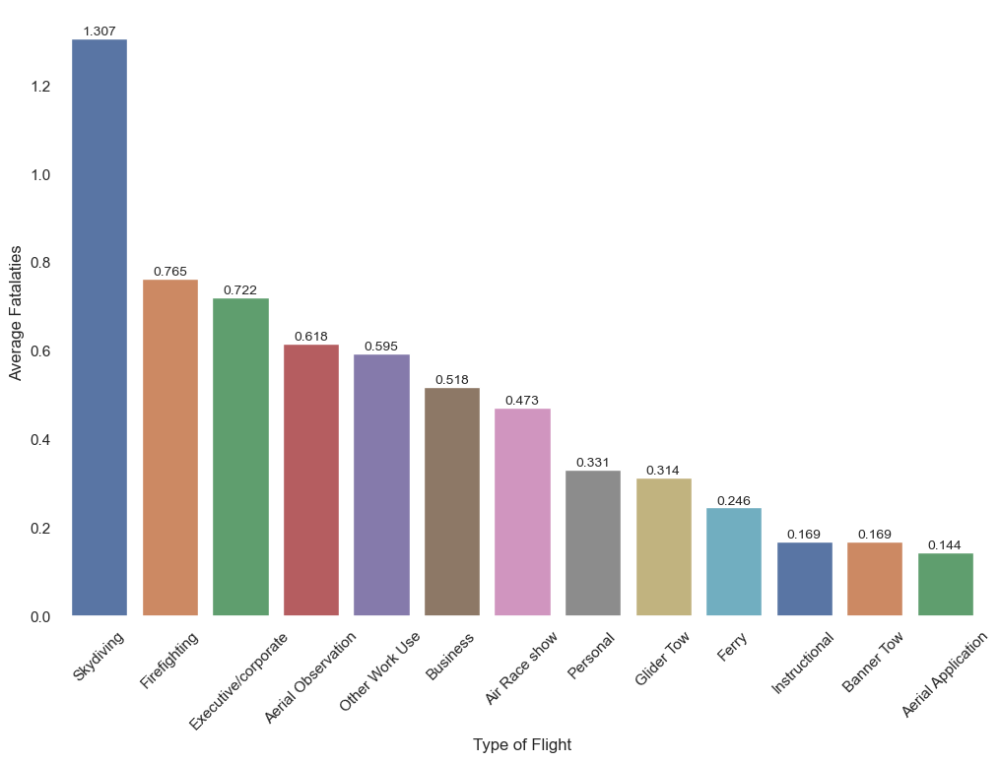
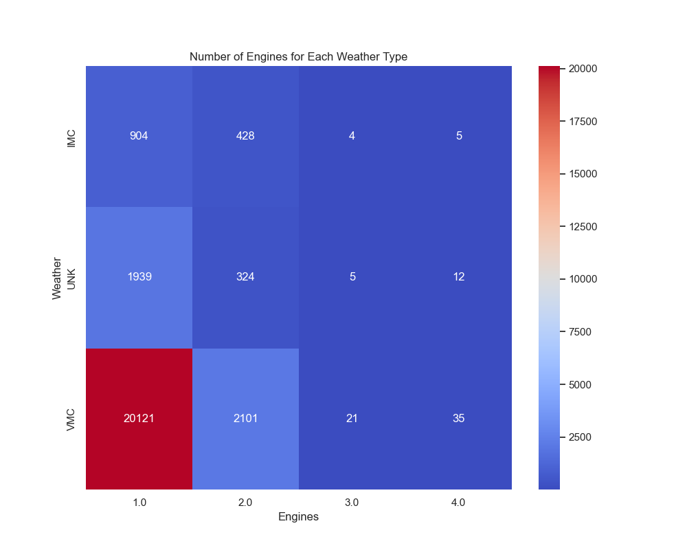
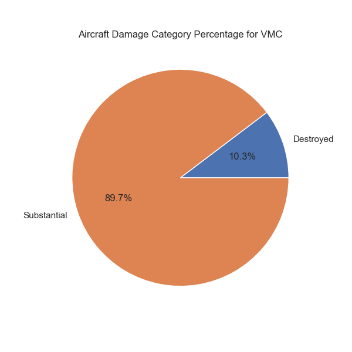
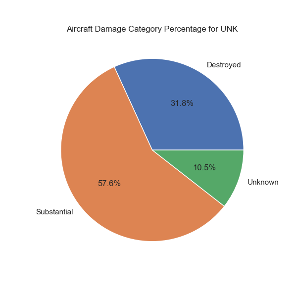

# Low Risk Aircraft assests for Business Venture

### Project Overview
---
The purpose of this project will be to analyze aviation accident data. The process will be to clean, analyze, and visualize data the purpose of generating insights for business stakeholders.

#### Business Problem
---

Projected company is expanding in to new industries to diversify its portfolio. Specifically, they are interested in purchasing and operating airplanes for **commercial** and **private** enterprises, but do not know anything about the potential risks of aircraft. You are charged with determining which aircraft are the **lowest risk** for the company to start this new business endeavor. Findings will be translated into actionable insights that the head of the new aviation division can use to help decide which aircraft to purchase.

#### Data Source and Data Exploration
---

This data come from [Kaggle](https://www.kaggle.com/datasets/khsamaha/aviation-accident-database-synopses) provides NTSB aviation accident information from 1962 and later about civil aviation accidents. Dataset includes incidents within the United States, its territories and possessions, and in international waters.

Step one will be to clean the data and replace or remove `NAN` values and remove incomplete accident data. After this the goal is to answer the following Data Analysis Goals.

#### Data Analysis Goals
---
- What types of flights have the highest average fatalities and damage to aircraft?
- What effect on safety do engines have and how much is this affected by weather?
- Which make and models have the lowest risk for commercial ventures?

### Question 1
#### What types of flights have the highest average fatalities?
---

To answer our first problem we will calculate the mean for fatalities for each purpose in the purpose column. This will help later with our data analysis and show us some good starting data for what type of business would have the most/least risk of fatalities.

#### Data Analysis
---

To answer our first problem we will calculate the mean for fatalities for each purpose in the purpose column. This will help later with our data analysis and show us some good starting data for what type of business would have the most/least risk of fatalities.

    

Viewing  plotting results. This will allow us to show what categories of business have the least fatalities associated with that business type. After this plotting the results.

    

    

    

### Question 2
#### What effect on safety do engines have and how much is this effected by weather?
---

To answer our second question we will be looking at the percentages of accidents taking place for each weather category. We will also be plotting what number of engines is associated with these accidents.

#### Weather Information
---
Defining variables in data set for a better understanding of what condistions are stored in dataframe

**Instrument meteorological conditions (IMC)** 

- IMC refers to weather conditions that do not meet the criteria for Visual Meteorological Conditions. This means that the visibility and/or cloud clearance are below the minimum required for VMC.

- In IMC, pilots cannot adequately navigate or control the aircraft using visual references due to poor visibility or obscured horizon.

**Visual meteorological conditions (VMC)** 

- VMC refers to weather conditions in which pilots have sufficient visibility and reference to the ground or horizon to navigate and control the aircraft visually.

- When above 3,000ft or 1,000ft above terrain, whichever is higher:
        1500m horizontally and 1,000 ft vertically from cloud;
        Flight visibility 5km below 10,000ft and 8km above 10,000ft.
        
- When below 3,000ft or 1,000ft above terrain, whichever is higher:
         Clear of cloud and in sight of the surface;
         Flight visibility 5km.

    
   

    
    

    
    

    
    

    

### Question 3
#### Which make and models have the lowest risk for commercial ventures?
---

Now that we have gone thru alot of the data and determined most of the factors that affect safety. It is now time to put this information together and pruduce a list of low risk models for business ventures.

#### Severity rating 
---
We will be acheiving this risk assessment by using a Severity rating. Assigning weights to different factors associated with aviation accidents and incidents. 

Severity Index formula = (4 * Fatalities) + (3 * Serious Injuries) + (3 * Minor Injuries) + (Accident Severity Code) + (Engine Code) + (3 * Mean Fatal)

    Number of Fatalities (Weight: 4):
        Assign a weight of 4 to the number of fatalities in an accident. The rationale is that the loss of life is a critical measure of severity.

    Number of Serious Injuries (Weight: 3):
        Assign a weight of 3 to the number of serious injuries. While not as severe as fatalities, injuries contribute to the overall severity.

    Number of Minor Injuries (Weight: 2):
        Assign a weight of 2 to the number of minor injuries. Contribute to the overall severity of accident.

    Economic Loss:
        This is represented but the column Damage Code which has a value based on damage.

    Weather Safety:
        Assign a weight survivability in adverse weather conditions. This is represented by the column Engine Code based on previous data.

    Flight Purpose (Weight: 3):
        Assigning a weight based on the average fatalities per accident for given purpose.

#### Top 10 Low Risk Makes and Models

    
#### Top 10 High Risk Makes and Models    

    

# Conclusion

### Goal 1
---
Based on the data, skydiving, firefighting, and executive flights show the highest risk of fatalities, while instructional, banner tow, and aerial application activities demonstrate the least risk. The higher risk in the former activities aligns with their inherent dangers. Regarding aircraft damage, the findings correlate with fatalities except for air races. This deviation is understandable as these aircraft likely incorporate more safety features aimed at reducing fatalities.

#### Goal 2
---
The data suggests that a single-engine setup might be more conducive to surviving adverse weather conditions. The larger volume of data for single-engine aircraft likely contributes to its higher accuracy. However, more data is needed for multi-engine aircraft, especially for understanding their performance in adverse weather. Additionally, exploring the use cases for larger engine aircraft would provide valuable insights.

#### Goal 3
---
Utilizing a severity rating proved highly effective in consolidating the data into a numerical format. The amalgamation of data from our earlier objectives yielded valuable insights. Based on this analysis, we've formulated recommendations for 10 Make and Model combinations, each associated with a specific type of business.

#### Data Analysis 
---
While this data proved invaluable for analyzing aviation accidents and gaining insights, a more comprehensive set of information is necessary to offer a robust recommendation for a business model. This additional data would encompass the total number of flights for each model, the cost of damages for repair, and the intended locations for business initiation. Despite this need for further details, the gleaned data remains highly beneficial, allowing for valuable recommendations in establishing low-risk aviation businesses.

#### Further Data Exploration 
---
Further data exploration can be done in [Tableau](https://public.tableau.com/app/profile/joshua.cuellar/viz/LowRiskAircraftassestsforBusinessVenture/Dashboard1?publish=yes)

